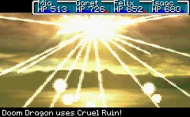

# Cruel Ruin

A downloadable bad idea, named for the party-wiping boss attack in Golden Sun 2.

This is a template / reference for manually binding a Rust library to a C++ executable,
because I keep forgetting the exact CMake and Cargo syntax to use, and how
to pass strings each way.
